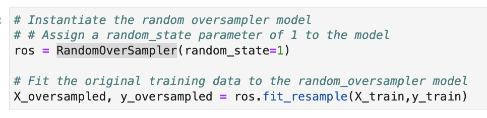
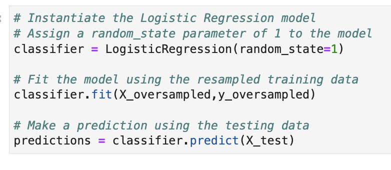
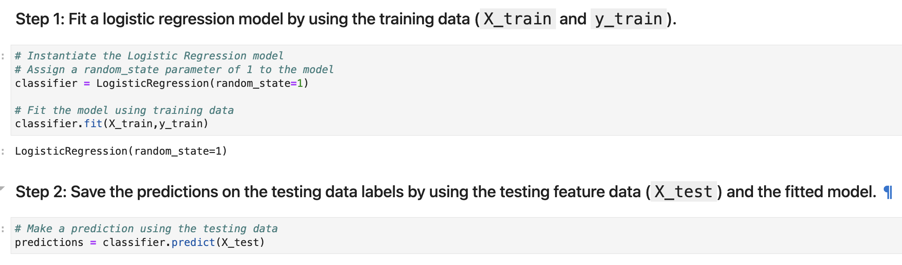
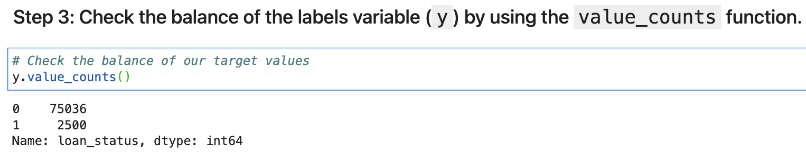
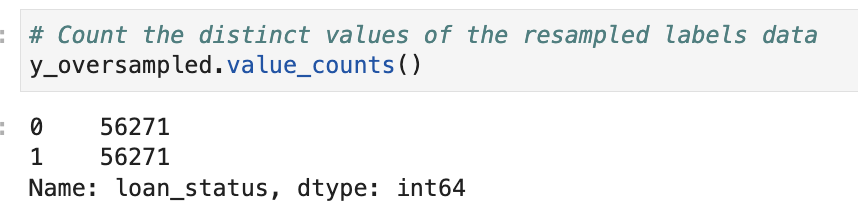

# Credit Risk Classification

## Overview of the Analysis

This markdown describes the analysis completed for the machine learning models used in this repository. This includes:

* Explain the purpose of the analysis.
* Explain what financial information the data was on, and what you needed to predict.
* Provide basic information about the variables you were trying to predict (e.g., `value_counts`).
* Describe the stages of the machine learning process you went through as part of this analysis.
* Briefly touch on any methods you used (e.g., `LogisticRegression`, or any resampling method).
* An explanation of the results obtained by the analysis
* A summary of the analysis

## Purpose
&nbsp;&nbsp;&nbsp;&nbsp;&nbsp;&nbsp;The purpose of this analysis is to create highly profficient Linear Regression classification models that can properly predict wether a loan has a `0`/healthy loan status or a `1`/high-risk loan status. The second purpose of this analysis is to see whether the original data or data resampled/randomly oversampled using `imblearn.over_sampling.RandomOverSampler` would yield better predictions from the `sklearn.linear_model.LogisticRegression` classification model. 





## Data
&nbsp;&nbsp;&nbsp;&nbsp;&nbsp;&nbsp;The data used included one-hot encoded labels `(0,1)` for the status of the loan. The loans that were healthy had a loan status of `0` and the loans that were high-risk had a loan status of `1`. The features that were used to predict the loan status included the loan size, interest rate, borrower income, debt to income, number of accounts, derogatory marks and total debt. Each of these features was recorded with numeric values as seen below.


## Target/Label Values
&nbsp;&nbsp;&nbsp;&nbsp;&nbsp;&nbsp;The target/label values that were used for training and prediction evaluation were one-hot encoded loan status values denoted as `0` for healthy loans and `1` for high-risk loans. The original target/label values had a total/value count of 75036 `0`/healthy loan values and 2500 `1`/high-risk loan values, for a total of 77536 values. Once the data was resampled/randomly oversampled the value count was 56271 for both teh `0`/healthy loan values and the `1`/high-risk loan values, for a total of 112542 values.





## Stages of the Machine Learning Process
&nbsp;&nbsp;&nbsp;&nbsp;&nbsp;&nbsp;The first step of the machine learning process was creating the classification model. In this case we were using the Logistic Regression model from `Scikit-learn`. After creating the model I used the `fit` method to fit the model using the training features/labels. After fitting the model with the training features/labels I generated predictions by feeding the test features to the model's `predict` method. After generating the predictions I evaluated the test predictions vs. the correct test labels using the following metrics: 
```
sklearn.metrics.balanced_accuracy_score
sklearn.metrics.confusion_matrix
imblearn.metrics.classification_report_imbalanced
```


## Important methods
&nbsp;&nbsp;&nbsp;&nbsp;&nbsp;&nbsp;The model used for the classification is the `sklearn.linear_model.LogisticRegression` and the method used to resample the data is the `imblearn.over_sampling.RandomOverSampler`.

 
 


## Results

Using bulleted lists, describe the balanced accuracy scores and the precision and recall scores of all machine learning models.

* Machine Learning Model 1 - Evaluation Metric Scores:
  * Balanced Accuracy Score: `0.9520479254722232`/`95%` accuracy
  * **`0`/Healthy Loans**:
	  * Precision Score: `1.00`/`100%` precision
	  * Recall Score: `0.99`/`99%` recall
  * **`0`/High-Risk Loans**:
	  * Precision Score: `0.85`/`85%` precision
	  * Recall Score: `0.91`/`91%` recall


* Machine Learning Model 2 - Evaluation Metric Scores:
  * Balanced Accuracy Score: `0.9936781215845847`/`99%` accuracy
  * **`0`/Healthy Loans**:
	  * Precision Score: `1.00`/`100%` precision
	  * Recall Score: `0.99`/`99%` recall
  * **`0`/High-Risk Loans**:
	  * Precision Score: `0.84`/`84%` precision
	  * Recall Score: `0.99`/`99%` recall

## Summary

Summarize the results of the machine learning models, and include a recommendation on the model to use, if any. For example:
* Which one seems to perform best? How do you know it performs best?
* Does performance depend on the problem we are trying to solve? (For example, is it more important to predict the `1`'s, or predict the `0`'s? )

If you do not recommend any of the models, please justify your reasoning.
