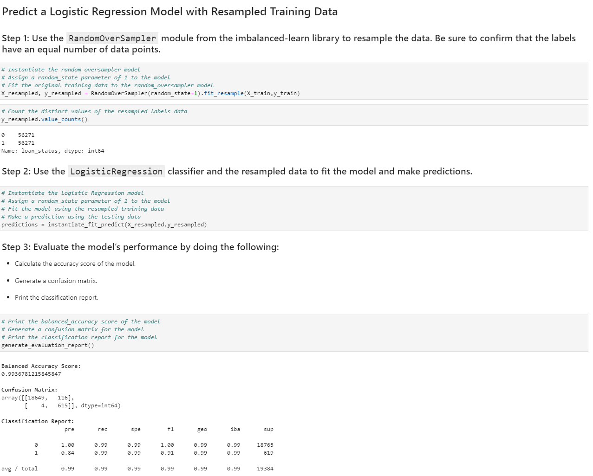
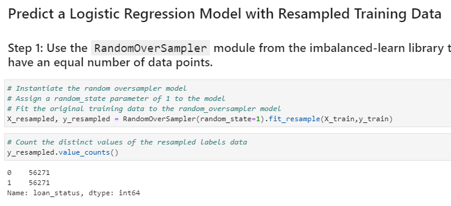

# Credit Risk Classification


## Overview of the Analysis

This markdown describes the analysis completed for the machine learning models used in this repository. This includes:

* Explain the purpose of the analysis.
* Explain what financial information the data was on, and what you needed to predict.
* Provide basic information about the variables you were trying to predict (e.g., `value_counts`).
* Describe the stages of the machine learning process you went through as part of this analysis.
* Briefly touch on any methods you used (e.g., `LogisticRegression`, or any resampling method).
* An explanation of the results obtained by the analysis
* A summary of the analysis
* Further analysis

## Purpose
&nbsp;&nbsp;&nbsp;&nbsp;&nbsp;&nbsp;The purpose of this analysis is to create highly profficient Linear Regression classification models that can properly predict wether a loan has a `0`/healthy loan status or a `1`/high-risk loan status. The second purpose of this analysis is to see whether the original data or data resampled/randomly oversampled using `imblearn.over_sampling.RandomOverSampler` would yield better predictions from the `sklearn.linear_model.LogisticRegression` classification model. 



## Data
&nbsp;&nbsp;&nbsp;&nbsp;&nbsp;&nbsp;The data used included one-hot encoded labels `(0,1)` for the status of the loan. The loans that were healthy had a loan status of `0` and the loans that were high-risk had a loan status of `1`. The features that were used to predict the loan status included the loan size, interest rate, borrower income, debt to income, number of accounts, derogatory marks and total debt. Each of these features was recorded with numeric values as seen below.


## Target/Label Values
&nbsp;&nbsp;&nbsp;&nbsp;&nbsp;&nbsp;The target/label values that were used for training and prediction evaluation were one-hot encoded loan status values denoted as `0` for healthy loans and `1` for high-risk loans. The original target/label values had a total/value count of 75036 `0`/healthy loan values and 2500 `1`/high-risk loan values, for a total of 77536 values. Once the data was resampled/randomly oversampled the value count was 56271 for both teh `0`/healthy loan values and the `1`/high-risk loan values, for a total of 112542 values.



## Stages of the Machine Learning Process
&nbsp;&nbsp;&nbsp;&nbsp;&nbsp;&nbsp;The first step of the machine learning process was creating the classification model. In this case we were using the Logistic Regression model from `Scikit-learn`. After creating the model I used the `fit` method to fit the model using the training features/labels. After fitting the model with the training features/labels I generated predictions by feeding the test features to the model's `predict` method. After generating the predictions I evaluated the test predictions vs. the correct test labels using the following metrics: 
```
sklearn.metrics.balanced_accuracy_score
sklearn.metrics.confusion_matrix
imblearn.metrics.classification_report_imbalanced
```


## Important Methods
&nbsp;&nbsp;&nbsp;&nbsp;&nbsp;&nbsp;The model used for the classification is the `sklearn.linear_model.LogisticRegression` and the method used to resample the data is the `imblearn.over_sampling.RandomOverSampler`.

 
 


## Results

##### **Model Evaluation Metric Scores**:

* Machine Learning Model 1:
  * Balanced Accuracy Score: `0.9520479254722232`/`95%` accuracy
  * **`0`/Healthy Loans**:
	  * Precision Score: `1.00`/`100%` precision
	  * Recall Score: `0.99`/`99%` recall
  * **`1`/High-Risk Loans**:
	  * Precision Score: `0.85`/`85%` precision
	  * Recall Score: `0.91`/`91%` recall

* Machine Learning Model 2:
  * Balanced Accuracy Score: `0.9936781215845847`/`99%` accuracy
  * **`0`/Healthy Loans**:
	  * Precision Score: `1.00`/`100%` precision
	  * Recall Score: `0.99`/`99%` recall
  * **`1`/High-Risk Loans**:
	  * Precision Score: `0.84`/`84%` precision
	  * Recall Score: `0.99`/`99%` recall

## Summary

&nbsp;&nbsp;&nbsp;&nbsp;&nbsp;&nbsp;As far as performance it seems that the second machine learning model, which was done using the resampled data, seems to perform the best and is therefore recommended. This is because it has both a higher balanced accuracy (`99%` vs `95%`) score as well as a higher recall score (`99%` vs `91%`) for the `1`/high-risk loans than the first machine learning model, even thought it has a minimal drop in prediction precision for the `1`/high-risk loans (`84%` vs `85%`).

&nbsp;&nbsp;&nbsp;&nbsp;&nbsp;&nbsp;In the case of the problem we are trying to solve the performance is most depended on the precision and recall scores for the `1`/high-risk loans. The vast majority of the data we are working with includes loans that are healthy and not high risk. These loans are have a posotive impact for the credit provider. But the high-risk loans are both minimal within our data and carry a highly negative impact on the credit provider. Due to this impact and scareness, it is extremely important for the model to be able to predict/recall `1`/high-risk loans. The second model was has a very similar (though slightly lower) prediction precision score (`84%` vs `85%`), yet has a much higher recall score (`99%` vs `91%`). Due to the importance of prediction/recall scores for the `1`/high-risk loans the second model is reccomend as it has a very similar precision score but much higher recall score.

## Further Analysis

&nbsp;&nbsp;&nbsp;&nbsp;&nbsp;&nbsp;For loan status of `0` (healthy loans), the logistic regression model correctly predicted 18,663 loans and incorrectly predicted only 56 loans which is a near 100% correct prediction rate. Through the classification report we can see that it scored a perfect 100% on predictions, F1 score and 99% on recall. Based on these reported values we can see that the logistic regression model worked very well in predicting `0`/healthy loan statuses. These results highly surpassed those of the `1`/high-risk loan status predictions and there is not much room for improvement.

&nbsp;&nbsp;&nbsp;&nbsp;&nbsp;&nbsp;For loan status of `1` (high-risk loans), the logistic regression model correctly predicted 563 loans and incorrectly predicted 102 loans which is approximately 85% correctly predicted loans. This is much lower than that of the healthy loan predictions. Through the classification report we can see that `1`/high-risk loan predictions were predicted correctly 85% of the time, garnered an 88% on its F1 score and scored 91% on recall. Based on these reported values we can see that the logistic regression model worked somewhat/moderately well in predicting `1`/high-risk loan statuses. Though, these predictions very much lagged behind the results seen for the `0`/healthy loan statuses, and though it did work somewhat/moderately well, there is most definitely lots of room for improvement.

&nbsp;&nbsp;&nbsp;&nbsp;&nbsp;&nbsp;For loan status of `0` (healthy loans), the logistic regression model, fit with oversampled data, correctly predicted 18,649 loans and incorrectly predicted only 4 loans which is a near 100% correct prediction rate and better than the predictions of the original data, which incorrectly predicted 56 `0`/healthy loan status. Through the classification report we can see that it scored a perfect 100% on predictions, F1 score and 99% on recall. Based on these reported values we can see that the logistic regression model worked very well in predicting `0`/healthy loan statuses. These results highly surpassed those of the `1`/high-risk loan status predictions and there is not much room for improvement. 
 
&nbsp;&nbsp;&nbsp;&nbsp;&nbsp;&nbsp;For loan status of `1` (high-risk loans), the logistic regression model, fit with oversampled data, correctly predicted 615 loans and incorrectly predicted 116 loans which is approximately 84% correctly predicted loans. This is much lower than that of the healthy loan predictions that was fit with oversampled data. Through the classification report we can see that `1`/high-risk loan predictions were predicted correctly 84% of the time, garnered a 91% on its F1 score and yet scored a whopping 99% on recall. Though, based on these reported values we can see that the logistic regression model, fit with oversampled data, still worked somewhat/moderately well in predicting `1`/high-risk loan statuses. Though, these predictions very much lagged behind the results seen for the `0`/healthy loan statuses using oversampled data, and though it did work somewhat/moderately well, there is most definitely lots of room for improvement.